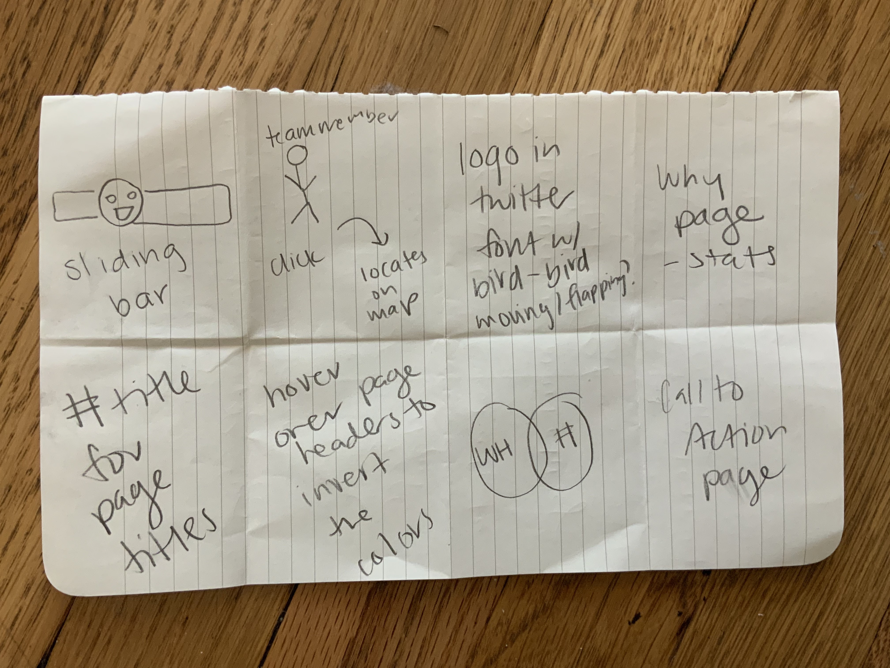
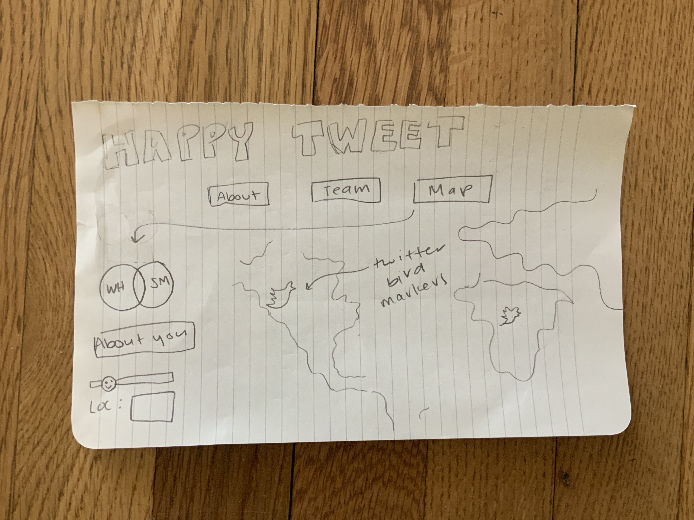
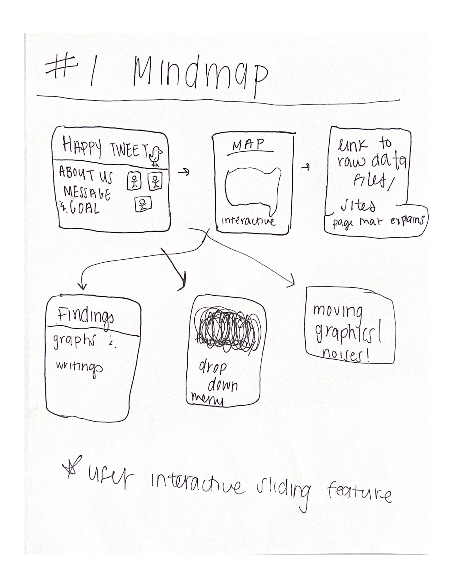
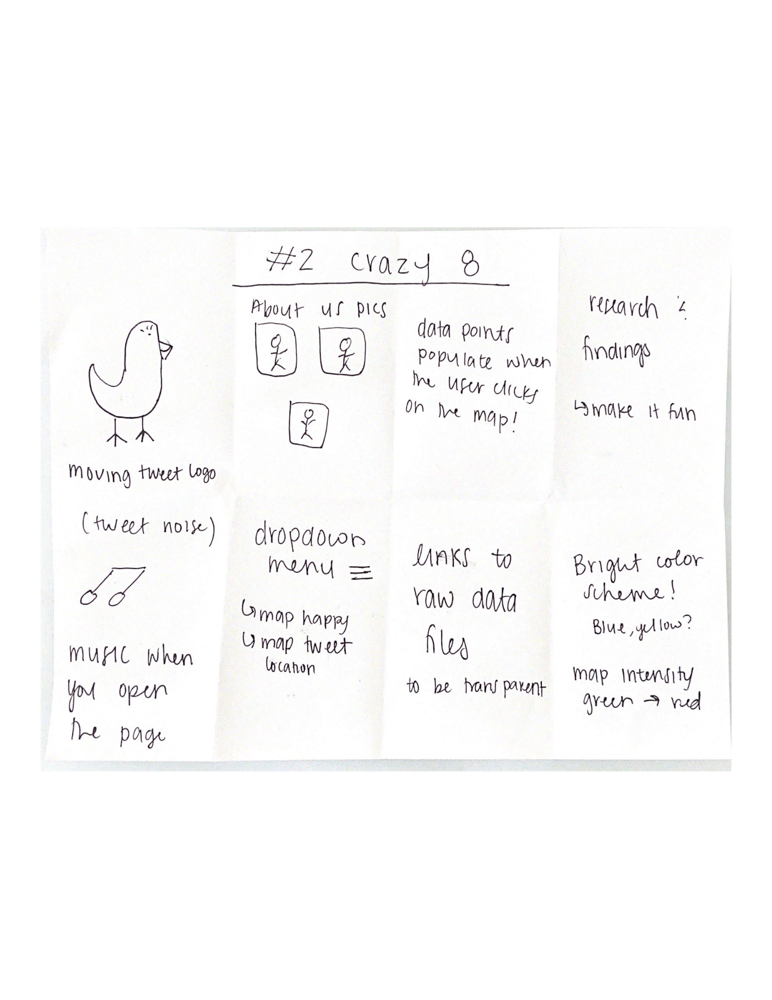

Part 1: Data Plan Update

We will be using two datasets, which are linked below. The first one shows Twitter user data that includes location information (in the form of latitutde and longitude). The second one shows data from World Happiness reports from 2018, since the Twitter data comes from 2018 as well.

Twitter Data: https://www.kaggle.com/sajidhasanapon/twitter-connections-with-user-location
World Happines Data: https://www.kaggle.com/unsdsn/world-happiness?select=2018.csv

All data will be downloaded as CSV files and will be geocoded using html, css, and javascript in Visual Code Studio...

Part 2: Storyboard

Our mind maps and crazy 8's can be viewed here: https://drive.google.com/drive/folders/19c2yBLVVg7wtwlWLsu2WnSX1s-8s-PBJ?usp=sharing

On our mindmaps and crazy 8's: 

When sharing our mind maps and crazy 8’s, we found that we were all on the same page/had similar ideas in terms of extra features that we wanted to add. The main ones include: some feature of interactivity for the users where they are able to engage with the map by using a slider bar or something similar to indicate their happiness level. We also want to include a feature that asks the user their location, and maybe their twitter usage so we can plot their points on the map as well.

Another similar idea we all had was to play on the Twitter bird logo. We want to make sure the logo is apparent across our website for aesthetic purposes.

Our storyboard plan was created using Figma, and can be viewed here: https://www.figma.com/file/tgmjnxUn9A8dYOLvF9vBH6/Wireframe-HappyTweet?node-id=0%3A1

