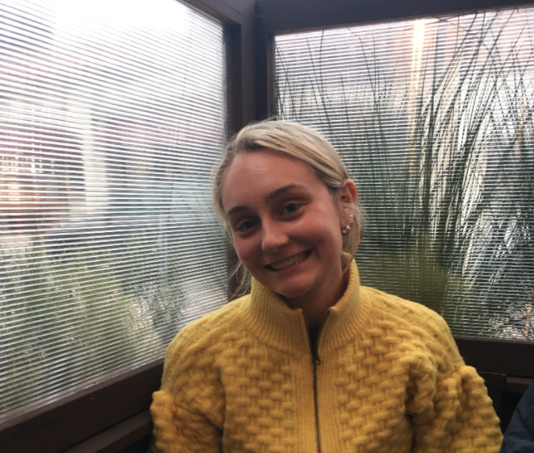

## Group Repository

https://github.com/ivanma9/HappyTweet

## Introduction:

Our group name is “Happy Tweet” and our project looks at social media usage (specifically Twitter usage) and happiness levels across cities in the U.S. We are trying to see if there is a relationship between trends in overall happiness and Twitter usage/content in the United States. The purpose of this project is to highlight the potential damaging nature of social media and the central role it plays in today’s society.

## Team Members:

### MJ Howland - Content Creator

I am a third-year sociology student minoring in digital humanities and art history. In my free time I serve as the co-captain of the UCLA Sailing Team. When I graduate, I am interested in pursuing a career in digital marketing and brand strategy.
For this project, I will be overseeing the writing and design process. I will be the one writing up anything for the website, including introductions, background information, research, etc. As for helping with the design, the plan is to draft ideas in Figma, a designing platform, so that Ivan can go in and utilize the actual code for my designs.

### Ivan Ma - Web Developer

I am a third-year/first year transfer computer science student. I love to play soccer on a competitive level and munch on all sorts of food.
I will be conducting most of the coding for this project. Piecing together our creative ideas into a web application that integrates thick mapping is a goal that I want to contribute for our project. I hope to collaborate with my group mates in Figma and keep and maintain good user design and experience for the interactivity of our site.

### Josephine Meyer-Hogan - Team Leader

Our group wants to investigate the potential connection between happiness and social media usage in the United States. We want to know if today’s heightened usage of social media has damaging mental consequences on the general public. We will be using twitter data that includes information about the content of a tweet and the location of the associated user, as well as a dataset from Wallethub that includes various measures that speak to the happiness levels of different cities. We hope to see if there is a potential correlation between these happiness levels and the amount of twitter activity by paying attention to which cities have more twitter users, and what the happiness scores of those cities are.
We think that this topic of social media is especially relevant considering today’s increased dependency on social media (and technology in general as a result of Covid-19).

## Methodology:

Web mapping is a very diverse method of communicating often used to tell stories, answer questions, and represent data. A map is able to portray information in a way that more traditional data graphics cannot. The perspective that comes with viewing data geographically is very unique and discovering correlations in the data becomes much easier. There is also often data that needs to be analyzed with the location in mind, as in our case. In our investigation, we are looking for a correlation between happiness and social media use in the US. This data utilizes geolocation as the foundation for data collection. Location provides a common ground that allows us to analyze and compare multiple data sets in order to find similarities.

## Workflow:

| Week   | Phase                                    | Tasks To Complete                                                                                                                             |
| ------ | ---------------------------------------- | --------------------------------------------------------------------------------------------------------------------------------------------- |
| 2      | Brainstorming                            | Group project proposal                                                                                                                        |
| 3      | Research                                 | <ul> <li> Do background research on our topic so that we can include relevant information on the website </li></ul>                           |
| 4      | Prep                                     | <ul><li> Data cleaning / refining</li><li> Finalizing the objectives we want to accomplish / what we want the end product to include</li><ul> |
| 5      | Starting to Code + Design                | <ul> <li> Start coding website </li><li> Start coding maps</li> <li> Start working in figma to create design </li></ul>                       |
| 6      | Continue Coding + Design                 | Continue Above                                                                                                                                |
| 7      | Continue Coding + Design + Start Writing | <ul> <li>Continue Above </li><li> Start drafting writing for the website </li></ul>                                                           |
| 8      | Continue Coding + Design + Writing       | Continue Above                                                                                                                                |
| 9      | Start to finalize                        | Start making edits and making sure all site pages have their proper content                                                                   |
| 10     | Continue finalizing                      | By now we should have the website pretty much completed and just making last minute edits                                                     |
| Finals | Final                                    | Present to the class                                                                                                                          |

## Technical Scope:

We will be using Git for our repository for easy collaboration. Leaflet library will be used for our mapping alongside Javascript to pair with it. HTML will be used for adding elements to the website in an organized fashion. Bootstrap and CSS will be used for styling and design.

## Data:

We will be using two datasets and producing three maps in total for this project.
Dataset #1: https://wallethub.com/edu/happiest-places-to-live/32619
Dataset #2: https://archive.org/details/twitter_cikm_2010
The first dataset shows data that includes user location and tweet content information compiled by the researchers Z. Cheng, J. Caverlee, and K. Lee, who scraped Twitter content from September 2009 to January 2010.
The second dataset shows happiness scores and indexes across different cities in the United States. It was compiled using various already existing reports with measures reflective of the following three categories: (1) emotion and physical well-being, (2) income and employment, and (3) community and environment. Example measures include happiness/depression indexes and suicide rates, poverty rates and income information, and hate-crime data, respectively. The dates of data used ranges from 2010 to 2014.
We will have two maps in total, one based off of dataset #1, one based off of dataset #2. We will have an option on our website to show a “third” map which will just overlay markers from both datasets.
